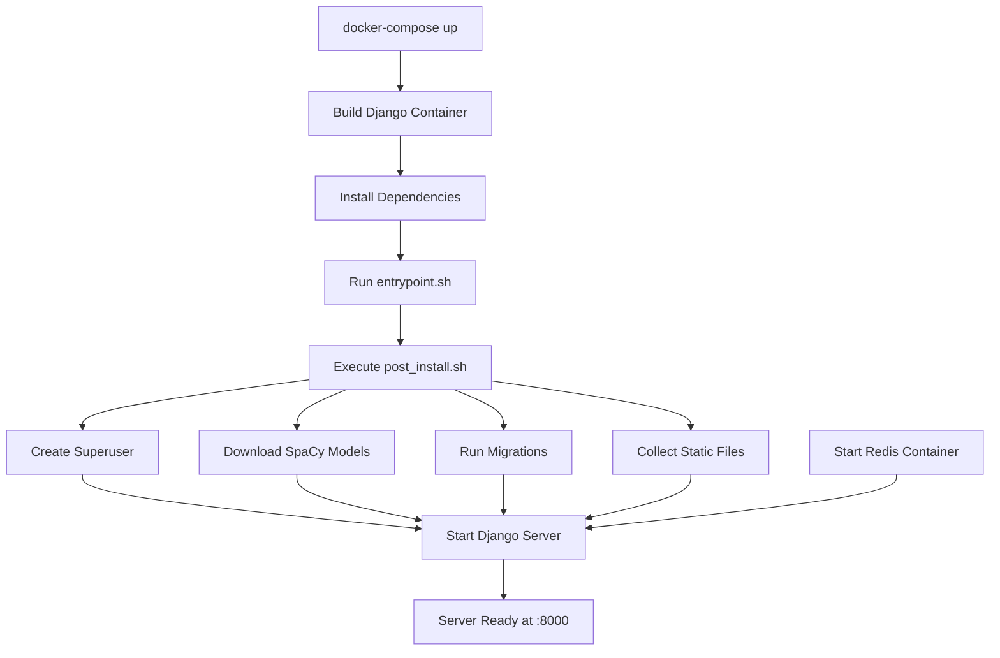

# 🚀 ARISE NLP Server - Quick Setup

**Get the ARISE NLP server running in under 5 minutes with Docker!**

## Prerequisites
- Docker & Docker Compose
- Git

## Environment Setup

Create a `.env` file in the project root:

```bash
# Required for superuser creation
DJANGO_SUPERUSER_USERNAME=admin
DJANGO_SUPERUSER_EMAIL=admin@arise.com
DJANGO_SUPERUSER_PASSWORD=your_secure_password

# Optional configurations
SECRET_KEY=your-secret-key-here
DEBUG=1
ALLOWED_HOSTS=localhost,127.0.0.1
REDIS_URL=redis://redis:6379
```

## One-Command Launch

```bash
docker-compose up --build
```

That's it! 🎉 Your NLP server will be available at `http://localhost:8000`

## What Happens During Setup



## Script Breakdown

### `entrypoint.sh`
Entry point that orchestrates the setup process by calling post_install.sh

### `post_install.sh` 
Main setup script that:
- Creates Django superuser (if needed)
- Downloads SpaCy language models

### `spacy_download.sh`
Downloads the English SpaCy model (`en_core_web_sm`) for NLP processing

### `superuser.sh`
Automated Django superuser creation using environment variables

## Services

- **Backend**: Django NLP API server (Port 8000)
- **Redis**: Message broker and caching (Port 6379)

## Admin Access

Visit `http://localhost:8000/admin` with your superuser credentials to access the Django admin panel.

---

*Built with Django, Redis, and Docker for scalable NLP processing*